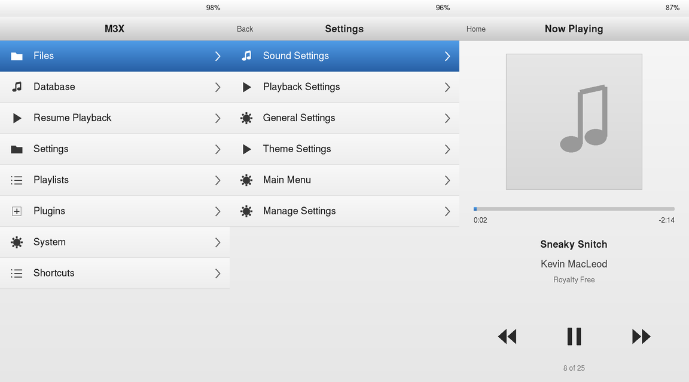

# Rockbox for Shanling M3X

An experimental native ARM64 Rockbox port for the Shanling M3X, running on its
existing rooted Android system. This is an independent development port. A
standalone installer supports the tested rooted firmware 1.75 setup; it is not
a firmware image or a ZIP for Magisk/recovery flashing.

**AI assistance disclaimer:** This project was written with the help of AI.
All changes and validation checks were approved by a human.

The port includes a 768×1280 touchscreen interface, hardware-key input, direct
internal-storage access, battery reporting, DAC routing and filters, software
volume/balance, and Android display takeover with thermal monitoring and recovery.
A desktop simulator and hardware-free driver replays support development without
the player attached.

## Current status

The M3X has now passed bounded native menu and MP3 playback tests. Touch and
physical controls respond, playlist-control paths work, and clean sound through
3.5 mm headphones with prompt volume response was confirmed by the user.

A later album test also confirmed clean playback of 24-bit/48 kHz FLAC sources
through the current 16-bit PCM output, correct cover art and metadata, and the
new theme's onscreen Next, pause/resume and Home controls. Music continues when
Home opens the main menu.

Device testing found that S32_LE passed open-only checks but failed at DSP
preparation. The player now uses a matched S16_LE stream and software-volume
output, validates preparation, and exits to Android recovery on unrecoverable
audio writes. A worker/control lock handoff fixed the reported volume/UI lag.

The host suite has 44 passing tests; two require private boot-image fixtures
and skip in a public checkout. Native ARM64 builds and packaged-module checks
pass. The earlier immediate status-139 crash did not recur in these tests,
but its original cause has not been traced conclusively.

A six-track FLAC album completed continuously in 11 min 13 s with zero detected
tinyalsa underruns, elapsed-time discontinuities or stalled PCM hardware pointers.
The screen stayed locked and dark for 8 min 38 s before a confirmed manual unlock;
full-album screen-off coverage therefore remains partial. CPU sensor0 stayed at
41–45 °C and battery temperature at 32.2–33.0 °C with USB connected.

An eight-track MP3/FLAC playlist also completed with the screen locked, exercising
native output rates of 44.1, 48, 88.2, 96, 176.4 and 192 kHz. The 32 kHz MP3 source
was output at 48 kHz. A duplicate-launch recovery bug was fixed and tested on the
player: refusing a second launch now leaves the active player and its Android
takeover intact. Android recovery was verified after both completed runs.

These checks observe software and PCM progress; analog dropouts and unplugged
battery consumption were not measured. Balanced output, absolute volume
calibration, DAC filter behavior, shuffle/repeat, plugins, physical shutdown,
suspend and physical microSD removal still need validation. Basic microSD access
now passes: a 128 GB card was formatted as FAT32, exposed as **Files → microSD**,
and used for MP3/FLAC playback and an Android unmount/remount check. Reboot persistence remains unverified; the standalone installer now creates
the microSD link. See
[the full checklist](M3X_OFFLINE_CHECKLIST.md).

## Launch from Android and return

Tap **Rockbox** in Android to start a one-time native session. Grant the app root
access in Magisk. Startup takes about 20 seconds, or longer if the player needs
to cool. Boot autostart stays disabled, and there is no session-duration timer.

To return, tap **Home** from Now Playing and choose **Return to Android** at the
bottom of Rockbox's main menu. This saves state, stops playback, closes audio and
restores Android without powering off or rebooting the M3X. A launch/play/return
round trip was verified on the device. Physical Power keeps its existing behavior.

The APK source, build instructions and prerequisites are in
[android-launcher/README.md](android-launcher/README.md). It launches the native
development installation; it does not install the port or firmware itself.

## Screen off and pocket controls

In the native M3X build, briefly press the physical power button to turn off
the backlight and lock touch. Music keeps playing, and the physical volume,
play/pause and previous/next buttons remain usable without lighting the screen.
Briefly press power again to wake it. Lift any finger resting on the screen
before touching again. Touchscreen wake gestures do not unlock pocket mode.

Holding power for three seconds requests normal Rockbox shutdown; the hold
logic is covered by input replays, with physical shutdown validation pending.
This screen-off mode leaves Linux running. Whole-system suspend remains
disabled because the previous display suspend path failed to wake reliably.

## iPod-style theme

The included `m3x-ipod` theme uses the full 768×1280 screen: silver headers,
light menu rows, blue selection, dark icons and chevrons, centred album art,
and large previous/play-pause/next touch controls. There is no click wheel.
The lists keep Rockbox's real menu contents and database browsing; album and
artist thumbnail grids from the design reference are not implemented.



Choose **Settings → Theme Settings → Browse Themes → m3x-ipod** after installing
a matching native player and assets. Tap **Back** in submenus and **Home** at
the top left of Now Playing to return to the main menu while music continues.
Physical power still controls pocket mode, and music/volume keys keep working.
Tracks without artwork show a neutral music-note placeholder.

The original artwork and native `.sbs`/`.wps` files are included in the source.
To regenerate them, install Pillow and run
`python3 tools/m3x/make-ipod-classic-theme.py`, then rebuild the assets with
`make -C build-m3x zip`. On macOS, with the M3X simulator built, SDL2/pkg-config and Pillow
installed, `python3 tools/m3x/preview-ipod-theme.py` checks menu taps, a scrolling
25-song list, playback, pause/resume and Home in an isolated temporary disk.
Audio is captured to a file, with no audible simulator playback.

## Repository layout

- `rockbox/`: complete upstream source snapshot plus the M3X target and assets.
- `m3x-module/`: current Android takeover and recovery launcher scripts.
- `tools/m3x/`: probes, regression tests, theme generation and development packaging.
- `media/`: the licensed test track and its attribution.

Upstream provenance and component licenses are recorded in [UPSTREAM.md](UPSTREAM.md).
This repository is an independent port and is not an official Rockbox or Shanling release.

## Build the native player

The native build used Android NDK r17c with its ARM64 GCC 4.9 standalone toolchain
and API 24. A modern NDK without GCC is not a drop-in replacement. You need Python 3,
Perl, Make, a host C compiler and zip/unzip. The NDK is supplied separately.
On Apple silicon, the NDK's x86_64 tools require Rosetta.

Run from the repository root, replacing the NDK path with your installation:

```sh
export ANDROID_NDK_PATH=/absolute/path/to/android-ndk-r17c
mkdir -p build-m3x
cd build-m3x
../rockbox/tools/configure --target=shanlingm3x --type=n --no-ccache
make -j4
make zip
cd ..
```

Outputs are `build-m3x/rockbox` and the matching `build-m3x/rockbox.zip` assets.
The executable, codecs and plugins must come from the same build.

After building, run the full offline checks and create a manual development bundle:

```sh
sh tools/m3x/verify-offline.sh
```

This does not connect to, flash or install anything on a player. The resulting
`build-m3x/m3x-offline-bundle.zip` is for manual development updates to an existing
setup. Boot images, rooted firmware and a Magisk installer are not included.

For the standalone installer, first build the Android launch APK with the
retained signing identity, then run `python3 tools/m3x/package-installer.py`.
This produces checksummed installer and corresponding-source ZIPs in
`build-m3x/release/`. Installation checks the target and backs up the previous
player, assets/settings, scripts, framebuffer helper and launcher APK. Updates
preserve settings and music; rollback restores the saved installation. See
[installation, update and rollback instructions](tools/m3x/INSTALL.md).

## Test with an M3X

Use an **already rooted M3X with working ADB/Magisk**. The development setup
used firmware 1.75 / Android 7.1.1; other firmware has not been tested. Audio
also needs the I2C5 GPIO18/19 device-tree fix described in
`tools/m3x/patch-dtb-gpio18.py`. This procedure does not root or flash the player.
Start with a cool device and headphones disconnected.

After the native build, run `sh tools/m3x/verify-offline.sh` to build the helper
and check the matching assets. Run these commands on your computer from the
repository root, with only the intended player connected:

```sh
adb devices
adb shell "su -c 'id'"  # Authorize debugging/root on the player; expect uid=0.
M3X_STAGE=$(mktemp -d)
unzip -q build-m3x/rockbox.zip -d "$M3X_STAGE"
adb shell "su -c 'mkdir -p /data/local/tmp/m3x-upload; rm -rf /data/local/tmp/m3x-upload/.rockbox'"
adb push "$M3X_STAGE/.rockbox" /data/local/tmp/m3x-upload/
adb push build-m3x/rockbox /data/local/tmp/m3x-upload/rockbox
adb push build-m3x/m3x-fbpan /data/local/tmp/m3x-upload/fbpan
adb push m3x-module/service.sh /data/local/tmp/m3x-upload/service.sh
adb push tools/m3x/launcher-probe.sh /data/local/tmp/m3x-launcher-probe.sh
adb push tools/m3x/collect-state.sh /data/local/tmp/m3x-collect-state.sh
adb push "media/Kevin MacLeod - Sneaky Snitch.mp3" /data/local/tmp/m3x-upload/test-song.mp3
```

Install the player and assets together, backing up any existing installation.
The following block runs a root shell on the player, aborts if Rockbox is already
running, and leaves automatic boot startup disabled. Record its printed backup
path and stop if any command fails:

```sh
adb shell -T 'su -c sh' <<'M3X_SETUP'
set -eu
if pidof rockbox rockbox-dbg >/dev/null; then
    echo 'Stop the existing Rockbox session and restore Android first.' >&2
    exit 1
fi
MOD=/data/adb/modules/rockbox_m3x
BACKUP=/data/local/tmp/m3x-before-test-$(date +%Y%m%d-%H%M%S)
mkdir -p "$BACKUP"
chmod 700 "$BACKUP"
if [ -d "$MOD" ]; then
    touch "$MOD/disable"
    cp -a "$MOD" "$BACKUP/module"
fi
if [ -d /data/media/0/.rockbox ]; then
    cp -a /data/media/0/.rockbox "$BACKUP/assets"
fi
if [ -f /data/local/tmp/fbpan ]; then
    cp -p /data/local/tmp/fbpan "$BACKUP/fbpan"
fi
mkdir -p "$MOD"
touch "$MOD/disable"
cp /data/local/tmp/m3x-upload/rockbox "$MOD/rockbox"
cp /data/local/tmp/m3x-upload/service.sh "$MOD/service.sh"
cp /data/local/tmp/m3x-upload/fbpan /data/local/tmp/fbpan
chmod 755 "$MOD/rockbox" "$MOD/service.sh" /data/local/tmp/fbpan
if [ -d /data/media/0/.rockbox ]; then
    mv /data/media/0/.rockbox "$BACKUP/assets-original"
fi
cp -a /data/local/tmp/m3x-upload/.rockbox /data/media/0/.rockbox
mkdir -p /data/media/0/Music
if [ ! -e '/data/media/0/Music/Kevin MacLeod - Sneaky Snitch.mp3' ]; then
    cp /data/local/tmp/m3x-upload/test-song.mp3 \
        '/data/media/0/Music/Kevin MacLeod - Sneaky Snitch.mp3'
fi
cat > /data/media/0/.rockbox/config.cfg <<'M3X_CONFIG'
resume on startup: off
start in screen: root
voice menus: off
touchscreen mode: point
volume: -60
backlight timeout: on
font: /.rockbox/fonts/35-Adobe-Helvetica.fnt
M3X_CONFIG
echo "Backup: $BACKUP"
M3X_SETUP
```

Start the **bounded menu test**:

```sh
adb shell "su -c 'sh /data/local/tmp/m3x-launcher-probe.sh'"
```

It detaches, waits ten seconds for Magisk logging, then starts Rockbox through
its launcher. Expect the menu about twelve seconds after Rockbox starts;
startup cooling can add a delay. Browse menus and check touch/buttons first.
The probe normally observes the launcher for about 75 seconds, with an
additional 100-second shutdown guard. Android should return automatically.
Both Android app runtimes and SurfaceFlinger stop during takeover; native
thermal services remain running. The launcher stops early at CPU ≥55 °C,
battery ≥40 °C or missing sensor readings. Avoid repeated `su` calls during
takeover because Magisk logging previously caused excessive CPU use.

Once the menu test passes, repeat it and select **Files → Music → Kevin MacLeod
- Sneaky Snitch.mp3**. Check that playback advances without playlist errors or
an immediate crash. Physical output level is uncalibrated: verify it before
listening, then check volume, play/pause and both jacks in short separate runs.

After Android returns, collect the results:

```sh
adb shell "su -c 'sh /data/local/tmp/m3x-collect-state.sh /data/local/tmp/m3x-state'"
mkdir -p validation/device-test
adb pull /data/local/tmp/m3x-state validation/device-test/
adb pull /data/local/tmp/m3x-launcher-probe.txt validation/device-test/
python3 tools/m3x/summarize-idle-probe.py validation/device-test/m3x-launcher-probe.txt
```

Confirm no Rockbox process remains, `zygote`, `zygote_secondary`, SurfaceFlinger
and `thermal-engine` are running, and `/data/adb/modules/rockbox_m3x/disable`
still exists. Keep diagnostics private until reviewed. If the player crashes
with status 139, retain the crash log/tombstone and exact build.

For rollback, wait for Android restoration, keep the module disabled and
restore the saved `module`, `assets` and `fbpan` from the printed backup path.
Do not copy old assets over the new tree: replace the tree so codecs/plugins
stay matched. If a test hangs, wait for the guard; the manual test leaves boot
startup disabled, so a hardware restart should return to Android. Persistent
boot and long playback tests remain separate hardware validation steps.

## Test without a player

The source-only checks need Python 3 and a C compiler with address/undefined
behavior sanitizers; no Android NDK is needed:

```sh
python3 -m unittest discover -s tools/m3x/tests -p test_native_drivers.py -v
python3 -m unittest discover -s tools/m3x/tests -p test_service.py -v
python3 -m unittest discover -s tools/m3x/tests -p test_boot_wrapper.py -v
```

The build-contract and shared-symbol tests require the completed ARM64 build.
Boot-image tests require the four privately supplied fixtures listed in
`tools/m3x/tests/test_boot_images.py`; stock firmware and personal backups are
excluded from Git.

The simulator was built on macOS with SDL2, pkg-config and GCC 16:

```sh
mkdir -p build-m3x-sim
cd build-m3x-sim
../rockbox/tools/configure --target=shanlingm3x --type=s --sdl-threads --no-ccache
make -j4
make install
# Supply the font used by the simulator smoke test.
mkdir -p simdisk/.rockbox/fonts
../rockbox/tools/convbdf -f -o simdisk/.rockbox/fonts/35-Adobe-Helvetica.fnt \
    ../rockbox/fonts/35-Adobe-Helvetica.bdf
cd ..
python3 tools/m3x/run-simulator-test.py
```

The automated smoke test currently uses macOS dynamic-library injection. It
decodes the bundled MP3 to a temporary audio file and captures menu/playing
screenshots, so there is no audible output. It tests shared UI/storage/codec
behavior; real Android linking and the physical DAC need device testing.

See [the tool guide](tools/m3x/README.md) for simulator controls, probes and the
read-only state collector to use when an M3X is available.
